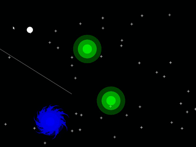

Lamak Quest
===========

Small 2D game in C++ with [SFML](https://www.sfml-dev.org).

Guide Lamak through the void of space with a single click.

Install
-------

Use [CMake](https://cmake.org) to compile the game. It requires SFML.

Precompiled binaries for windows are [available on github](https://github.com/kimci86/LamakQuest/releases).

License
-------

This project is provided under the terms of the MIT license.
See [LICENSE.txt](LICENSE.txt) for details.

Assets are in the public domain.
